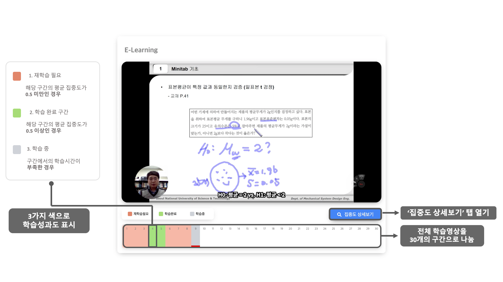
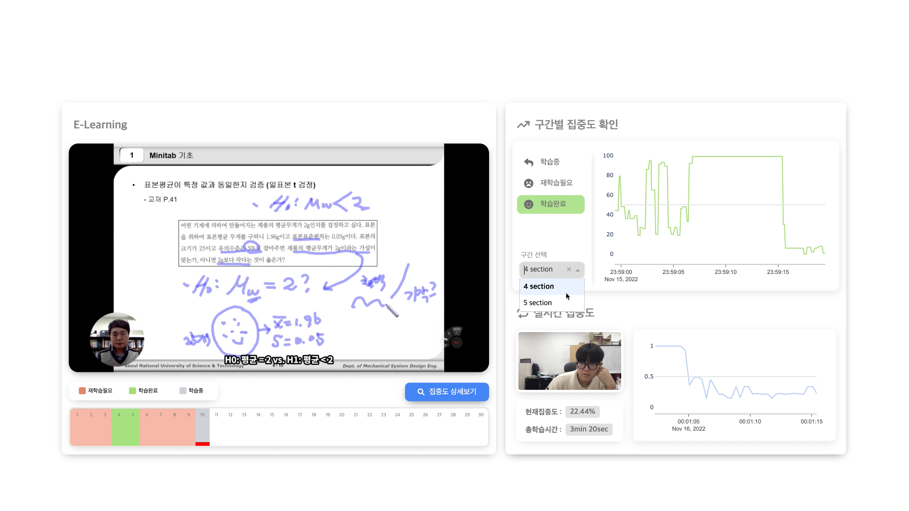
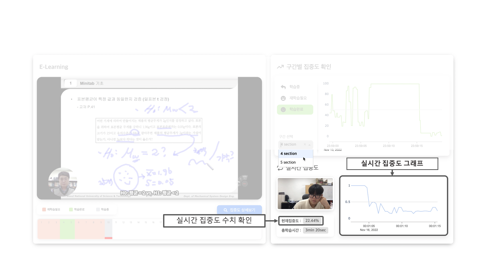
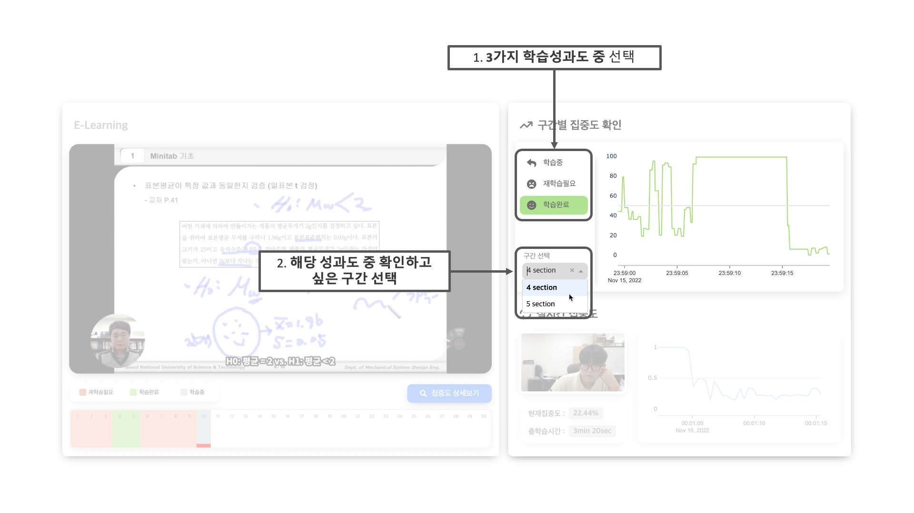

## 집중도 측정 모델을 이용한 E- Class 플레이어
#### 2022 서울과학기술대학교 기계시스템디자인 기계정보공학과 capstone design

* 팀원 
  * 강한 [GitHub] 
  * 이상윤 [GitHub](https://github.com/IceBear9028)
  * 박선영
* 개발언어 :  
* 라이브러리 :  

### capstone_UI 사용목적 :
학습자의 집중도 평가 모델을 온라인학습시 학습자 스스로의 집중도를 실시간으로 확인하여 본인 스스로 학습유도를 하기 위해 개발

## 화면구성 :
### 1. 처음 접속화면

### 2. '집중도 상세보기' 클릭

